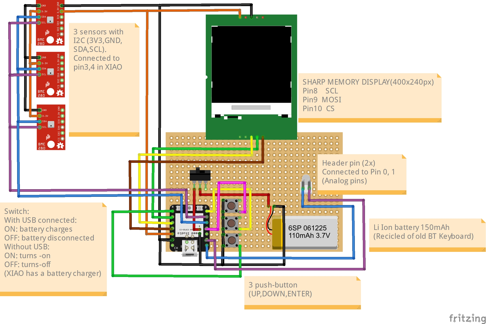
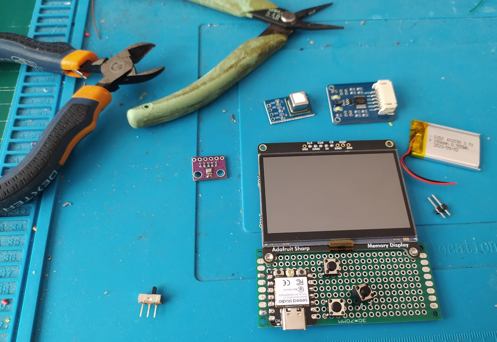
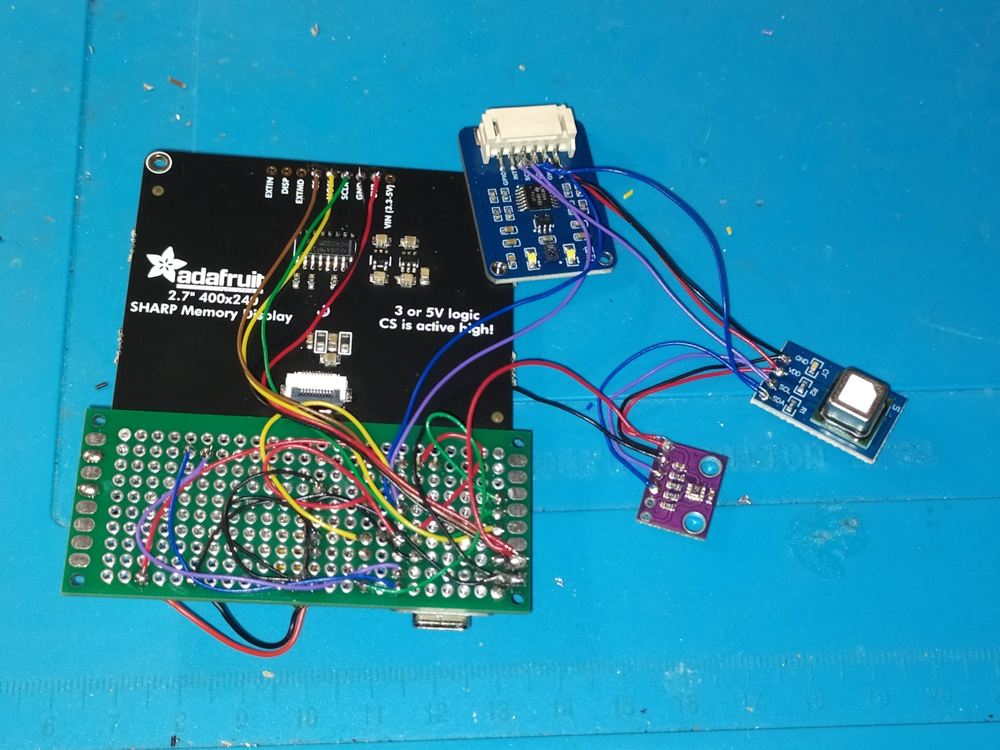
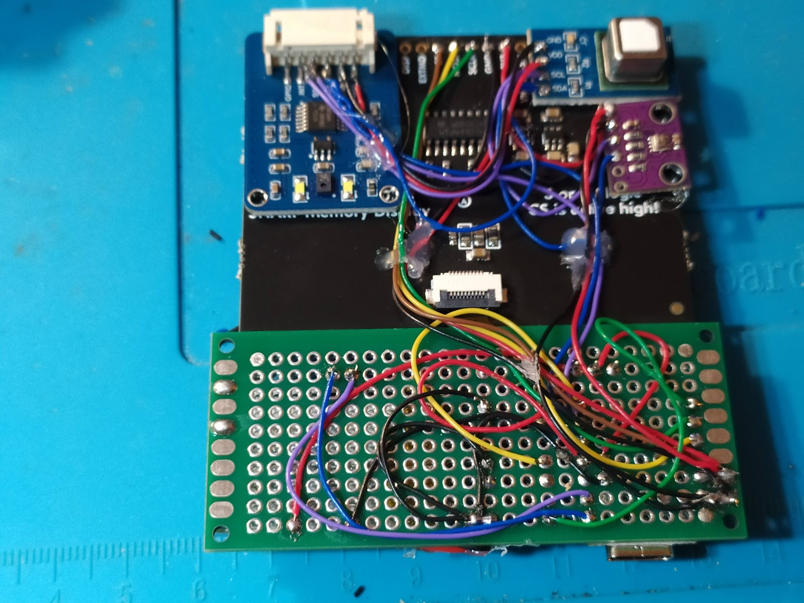
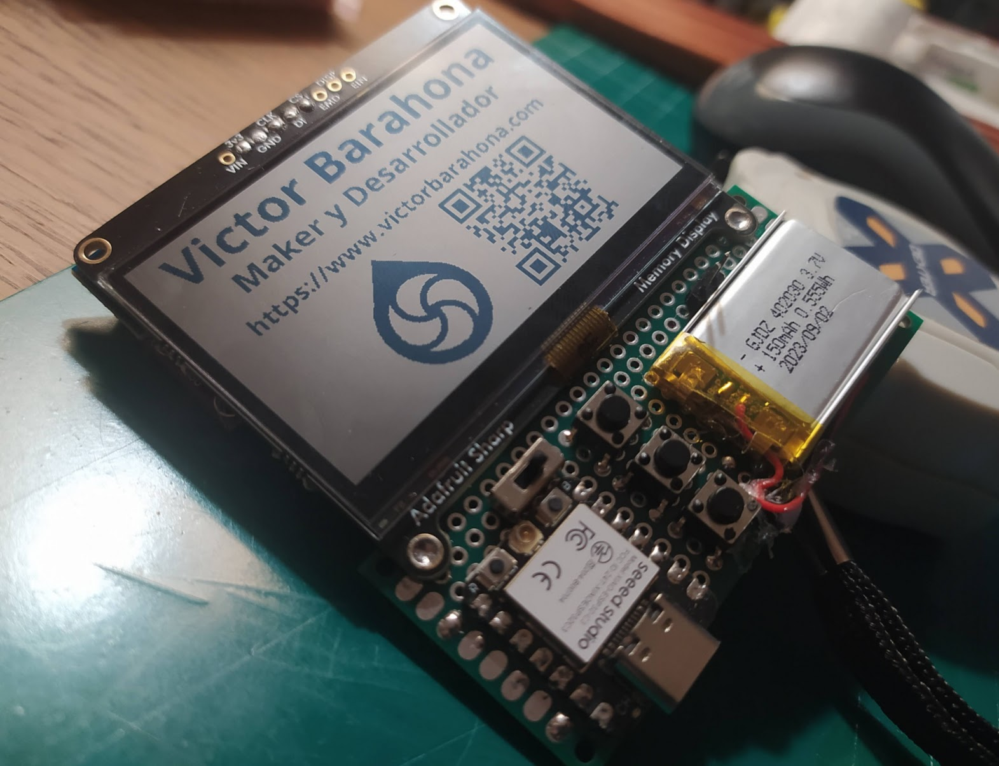
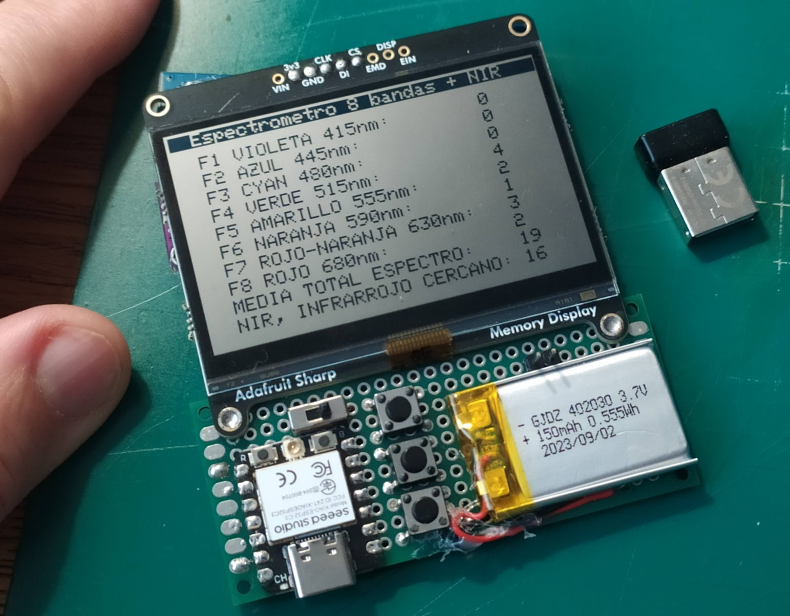

# Montaje de Tinycorder
# (English below)

## Esquema del dispositivo:

ATENCION: Algunos componentes no se muestran como son realmente ya que Fritzing no los contiene en las librerías. Y puede haber algun error en la nomenclatura de los pines. Tomar la información de este montaje con precaución.

## Montaje del dispositivo:

En esta imagen vemos los componentes que vamos a utilizar. La pantalla usa el bus SPI y los sensores el I2C, de solo dos pines.

Procedemos a soldar los componentes entre si.

En la perfboard soldamos el MCU, switch, 3 pushbutton y header de dos puntas. Para el XIAO alinear bien de tal forma que sus dos pad de bateria queden accesibles desde abajo, ya que aplicaremos una gota de soldadura y debe servir para que el circuito de control de la bateria funcione bien. Lo sabremos si al conectar el puerto USB tenemos unos 4V en esas dos conexiones. Si no lo tenemos hay que repasar la soldadura.

La perfboard la unimos al display con soldadura (tiene zonas metalicas donde el estaño agarra bien. Tambien puede hacerse con cola termofusible).

La batería la pegaremos con cola termofusible, igualmente los sensores, aprovechando el espacio libre en la parte trasera del display que es plano.

**ATENCION: Diseñé las piezas en PLA después de este punto con las medidas tal y como coloqué los componentes. Si construyes una copia tendrás que hacerlo al revés. Imprimir las piezas y usarlas como guía para pegar os sensores, si no no te cabrán correctamente.**

Una vez montado y cargado el software vemos el aspecto que tiene.

Y aquí como espectrómetro numérico, los valores se ven bajos porque el sensor está contra la mesa y no recibe luz.

***

## Tinycorder Assembly

## Device schematic:

WARNING: Some components are not shown as they really are because Fritzing does not include them in its libraries. There may also be some errors in pin naming. Take the information from this assembly with caution.

## Device assembly:

In this image we see the components we are going to use. The display uses the SPI bus and the sensors use I2C, which only requires two pins.

We proceed to solder the components together.

On the perfboard, solder the MCU, switch, 3 pushbuttons, and a two-pin header. For the XIAO, align it so that its two battery pads are accessible from below, as we will apply a drop of solder and it must allow the battery control circuit to work properly. We will know it works if, when connecting the USB port, we have about 4V on those two connections. If not, check the soldering.

Join the perfboard to the display with solder (it has metallic areas where the tin adheres well. It can also be done with hot glue).

Glue the battery with hot glue, as well as the sensors, taking advantage of the free space on the back of the display, which is flat.

**WARNING: I designed the PLA parts after this point with the measurements as I placed the components. If you build a copy, you will have to do it the other way around: print the parts and use them as a guide to glue the sensors, otherwise they will not fit correctly.**

Once assembled and the software loaded, this is how it looks.

And here as a numeric spectrometer, the values appear low because the sensor is facing the table and does not receive light.

***

