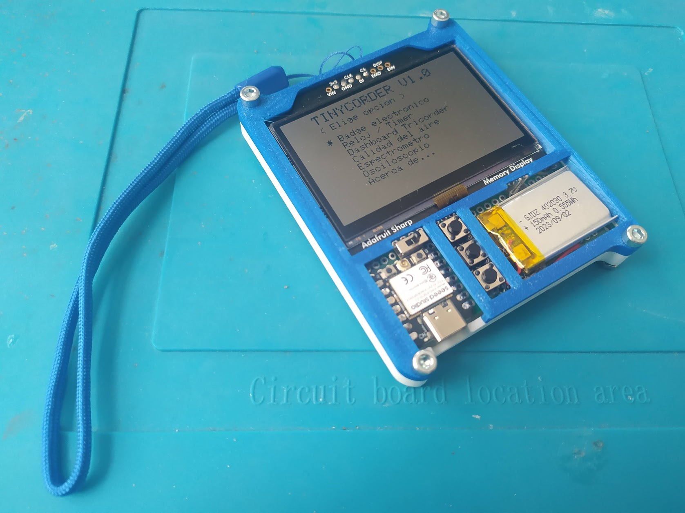
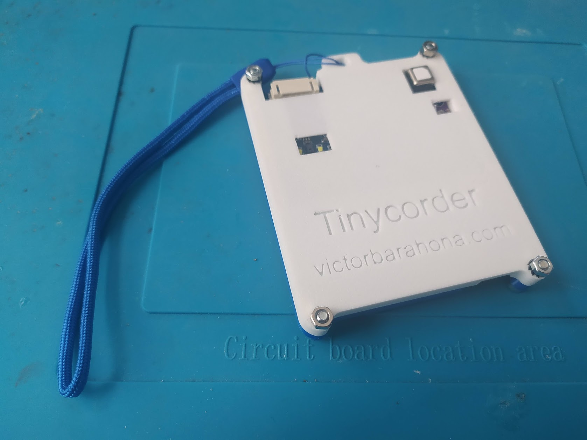
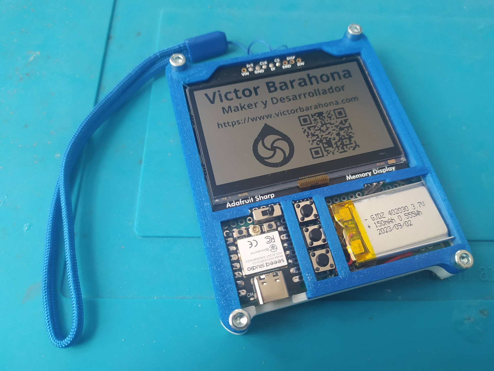
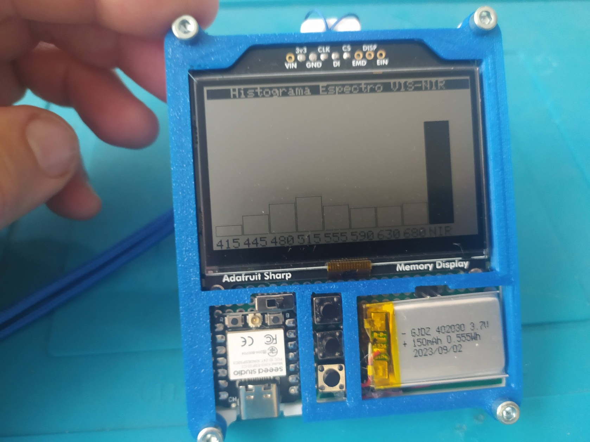

# Tinycorder

## Un pequeño dispositivo multiuso con sensores

**Tinycorder** es un pequeño dispositivo multiuso que busca homenajear al mítico **tricorder** de la serie de ciencia ficción **Star Trek.**

Incluye varios sensores, asi como una pantalla de alta resolucion y bajo consumo que permite que lo usemos como badge electronico.

Es pequeño (75x85x10mm), ligero (70gr) y gasta muy poca energía.

## Características principales:

- Chasis de dos piezas en PLA que se unen mediante 4 tornillos de M3x10.
- Incluye gancho para poderlo colgar del cuello o de la mano.
- MCU XIAO ESP32C3 de Seeed Studio.
- Batería Ion Litio de 150mAh.
- Interruptor de encendido y 3 pushbutton para interfaz (Up, Down, Enter).
- Pantalla Sharp Memory Display de 400x240px de Adafruit. Muy bajo consumo. 
- Sensor AS7341 para medición de luz en 7 bandas de visible y NIR (IR cercano).
- Sensor SCD40 para medición de calidad del aire y CO2.
- Sensor BMP280 para medición de temperatura, humedad y presión.
- 2 pines libres accesibles desde frontal para medir señales analógicas.

## Algunas funciones ya en servicio:

## Contenido de las carpetas:

[**Montaje** ](Montaje/README.md) 

Proceso de montaje mediante fotos comentadas. 

[**STLs** ](STL/README.md) 

Ficheros STL listos para imprimir. 

[**SRC** ](STL/README.md) 

Ficheros Arduino.

## Lista de componentes (BOM)

[BOM.xls](BOM.xlsx)

## Autor

Me llamo **Victor Barahona** y soy un ingeniero que ha sabido adaptarse a diferentes olas tecnológicas a lo largo de 30 años de carrera profesional. Tanto en el sector público como privado, tanto por cuenta ajena como de autónomo y emprendedor.

He trabajado en enseñanza, industria de automoción, telefonía móvil, impresión 3D, desarrollo de proyectos opensource y actualmente estoy en la empresa **I+Med** donde investigo en sistemas embebidos y Bioelectrónica.

Tengo varios hobbies, entre ellos la Permacultura. Soy también un maker entusiasta y construyo cosas como impresoras 3D o ARSandbox.

**Hago este tipo de proyectos en mi tiempo libre. Si te gustan y deseas apoyar que siga con ellos puedes donar o aportar en ko-fi:**

[**Mi cuenta Github**](https://github.com/Egokitek)

[Mi sitio web **www.victorbarahona.com**](http://www.victorbarahona.com)

## Créditos

Star Trek me inspiró para realizar este proyecto pero el diseño es totalmente propio.

## Licencia

**GPL3.0**

## Posibles mejoras

- Monitorear tension de batería y mostrarla mediante un indicador.
- Añadir funciones pendientes como tester/osciloscopio
- Nuevas funciones que se me vayan ocurriendo.

