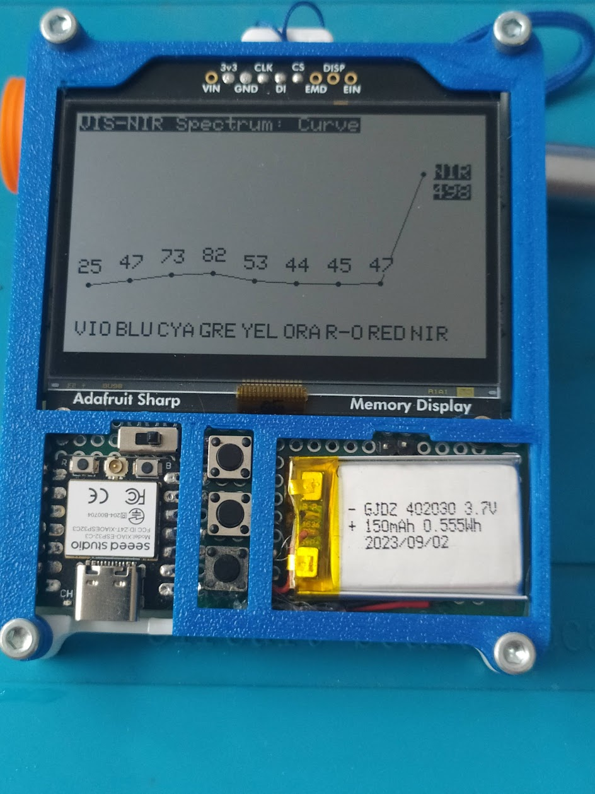

# Tinycorder (ES)

**(English below)**

## Un pequeño dispositivo multiuso con sensores

**Tinycorder** es un pequeño dispositivo multiuso que busca homenajear al mítico **tricorder** de la serie de ciencia ficción **Star Trek.**

Incluye varios sensores, asi como una pantalla de alta resolucion y bajo consumo que permite que lo usemos como badge electronico.

Es pequeño (75x85x10mm), ligero (70gr) y gasta muy poca energía.

## Características principales

- Chasis de dos piezas en PLA que se unen mediante 4 tornillos de M3x10.
- Incluye gancho para poderlo colgar del cuello o de la mano.
- MCU XIAO ESP32C3 de Seeed Studio.
- Batería Ion Litio de 150mAh.
- Interruptor de encendido y 3 pushbutton para interfaz (Up, Down, Enter).
- Pantalla Sharp Memory Display de 400x240px de Adafruit. Muy bajo consumo. 
- Sensor AS7341 para medición de luz en 7 bandas de visible y NIR (IR cercano).
- Sensor SCD40 para medición de calidad del aire y CO2.
- 2 pines libres accesibles desde frontal para medir señales analógicas.

## Algunas funciones ya en servicio

## Contenido de las carpetas

[**Montaje**](Montaje/README.md)

Proceso de montaje mediante fotos comentadas.

[**STLs**](STL/README.md)

Ficheros STL listos para imprimir.

[**SRC**](SRC/README.md)

Ficheros Arduino.

## Lista de componentes (BOM)

[BOM.xls](BOM.xlsx)

## Autor

Me llamo **Victor Barahona** y soy un ingeniero que ha sabido adaptarse a diferentes olas tecnológicas a lo largo de 30 años de carrera profesional. Tanto en el sector público como privado, tanto por cuenta ajena como de autónomo y emprendedor.

He trabajado en enseñanza, industria de automoción, telefonía móvil, impresión 3D, desarrollo de proyectos opensource y actualmente estoy en la empresa **I+Med** donde investigo en sistemas embebidos y Bioelectrónica.

Tengo varios hobbies, entre ellos la Permacultura. Soy también un maker entusiasta y construyo cosas como impresoras 3D o ARSandbox.

**Hago este tipo de proyectos en mi tiempo libre. Si te gustan y deseas apoyar que siga con ellos puedes donar o aportar en ko-fi:**

[**Mi cuenta Github**](https://github.com/Egokitek)

[Mi sitio web **www.victorbarahona.com**](http://www.victorbarahona.com)

## Créditos

Star Trek me inspiró para realizar este proyecto pero el diseño es totalmente propio.

## Licencia

GPL3.0

## Posibles mejoras

- Monitorear tension de batería y mostrarla mediante un indicador.
- Añadir funciones pendientes como tester/osciloscopio
- Nuevas funciones que se me vayan ocurriendo.

## Version 2 (actualizada el 6 de Julio de 2025)

**Se completa el código con los siguientes cambios:**

- Se completa la funcion de timer, permite ajustar bloques de 5 hasta 120 min. En el bloque de 25min aparece un mensaje de "Pomodoro Timer !". Al activar comienza cuenta atras y al terminar avisa con un rotulo intermitente en pantalla.
- Se completa el menu de Dashboard, que muestra medidas de CO2, temp y humedad en forma de histograma, con medidas cada 5 min hasta un total de 24 por cada variable. El tiempo entre muestras se puede cambiar en firmware para que tome un tiempo mas amplio de muestreo total.
- El menu "Calidad del aire" presenta medidas de CO2, temperatura y humedad cada 5 segundos de forma continua, hasta que vuelvas al menu principal.
- El menú "espectrómetro ya funcionaba pero se ha mejorado. Ahora puede mostrar el espectro en forma de histograma, lineas o numérico, se puede cambiar entre cualquiera de ellos o volver al menu principal.
- El menú "Acerca de" se ha mejorado en estética y presenta información básica.
- Se ha eliminado por el momento la función de osciloscopio. Quizás se aborde en el futuro.

**Cambios pendientes:**

- Añadir un buzzer pequeño para dar sonido al dispositivo.
- Añadir un sensor de tiempo de vuelo para medir distancia y quizas generar una especie de "sonar".
- Optimizar el consumo jugando mejor con los procesos de deep sleep.
- Opción de activar/desactivar LED para linterna, usando los que lleva el sensor de espectrómetro.
- Control de tensión de batería para ver autonomía en pantalla.
- Probar con otras pantallas mas economicas y rediseñar el hardware. La Sharp es muy buena pero es algo cara.
- **Importante** crear la PCB. Ahora es una perfboard ya que es un prototipo.
- ¿ Que mas .....?

---

# Tinycorder (EN)

## A small multi-purpose device with sensors

**Tinycorder** is a small multi-purpose device that pays homage to the legendary **tricorder** from the science fiction series **Star Trek.**

It includes several sensors, as well as a high-resolution, low-power display that allows it to be used as an electronic badge.

It is small (75x85x10mm), lightweight (70g), and consumes very little power.

## Main features

- Two-piece PLA chassis joined by 4 M3x10 screws.
- Includes a hook to hang it from your neck or hand.
- Seeed Studio XIAO ESP32C3 MCU.
- 150mAh Lithium-Ion battery.
- Power switch and 3 pushbuttons for interface (Up, Down, Enter).
- Adafruit Sharp Memory Display 400x240px. Very low power consumption.
- AS7341 sensor for measuring light in 7 visible and NIR (near IR) bands.
- SCD40 sensor for air quality and CO2 measurement.
- BMP280 sensor for temperature, humidity, and pressure measurement.
- 2 free pins accessible from the front to measure analog signals.

## Some functions already in service

## Folder contents

[**Assembly**](Montaje/README.md)

Assembly process with commented photos.

[**STLs**](STL/README.md)

Ready-to-print STL files.

[**SRC**](SRC/README.md)

Arduino files.

## Bill of Materials (BOM)

[BOM.xls](BOM.xlsx)

## Author

My name is **Victor Barahona** and I am an engineer who has adapted to different technological waves over 30 years of professional career. Both in the public and private sectors, as an employee, freelancer, and entrepreneur.

I have worked in education, automotive industry, mobile telephony, 3D printing, open source project development, and I am currently at **I+Med** where I research embedded systems and Bioelectronics.

I have several hobbies, including Permaculture. I am also an enthusiastic maker and build things like 3D printers or ARSandbox.

**I do these kinds of projects in my free time. If you like them and want to support me to continue, you can donate or contribute on ko-fi:**

[**My Github account**](https://github.com/Egokitek)

[My website **www.victorbarahona.com**](http://www.victorbarahona.com)

## Credits

Star Trek inspired me to make this project but the design is entirely my own.

## License

GPL3.0

## Possible improvements

- Monitor battery voltage and display it with an indicator.
- Add pending functions such as tester/oscilloscope
- New functions as they occur to me.

## Version 2 (updated July 6, 2025)

**The code is completed with the following changes:**

- The timer function is completed, allowing you to set blocks from 5 to 120 min. In the 25min block, a "Pomodoro Timer!" message appears. When activated, it starts a countdown and, when finished, notifies with a flashing label on the screen.
- The Dashboard menu is completed, showing CO2, temp, and humidity measurements as a histogram, with measurements every 5 min up to a total of 24 for each variable. The time between samples can be changed in firmware to take a longer total sampling time.
- The "Air Quality" menu presents CO2, temperature, and humidity measurements every 5 seconds continuously, until you return to the main menu.
- The "Spectrometer" menu was already working but has been improved. Now it can display the spectrum as a histogram, lines, or numeric; you can switch between any of them or return to the main menu.
- The "About" menu has been improved in appearance and presents basic information.
- The oscilloscope function has been removed for now. It may be addressed in the future.

**Pending changes:**

- Add a small buzzer to give sound to the device.
- Add a time-of-flight sensor to measure distance and perhaps generate a kind of "sonar".
- Optimize power consumption by better managing deep sleep processes.
- Option to enable/disable LED for flashlight, using those on the spectrometer sensor.
- Battery voltage control to see autonomy on screen.
- Try other, more economical displays and redesign the hardware. The Sharp is very good but somewhat expensive.
- **Important** create the PCB. It is currently a perfboard as it is a prototype.
- What else...?
